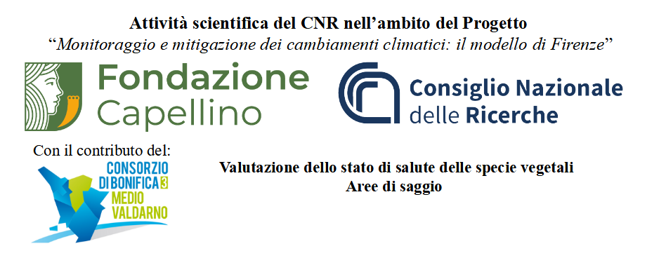

## Progetto

Aree di saggio progetto “Monitoraggio e mitigazione dei cambiamenti climatici: il modello di Firenze”

### Descrizione

le attività scientifiche del progetto saranno indirizzate a studiare il fenomeno 
della biodiversità a Firenze con due obiettivi specifici a diverse scale di dettaglio:

1. Obiettivo specifico 1 - Attività di ricerca condotte su un’area “laboratorio”, ossia 
un’area di circa 16 ha (l’asta dell’Arno lunga circa 4 km sulla sponda destra idraulica 
tra il Ponte all’Indiano e il ponte dell’Autostrada A1) in cui il CNR, con il supporto di 
altri Partner, effettuerà alcune indagini e ricerche di dettaglio per supportare 
scientificamente quelli che saranno gli effetti dell’intervento di inverdimento previsto 
su quest’area. L’obiettivo è quindi quello di creare un modello di studio il più possibile 
replicabile ed esportabile in altri contesti urbani e che tenga conto delle specificità 
dell’area oggetto di studio. In particolare, il CNR studierà la situazione ecosistemica 
attuale di questa area laboratorio e le migliorie o in generale gli impatti che si otterranno 
dagli interventi previsti nel progetto.

2. Obiettivo specifico 2  - Attività di ricerca estese a tutto il territorio del comune di 
Firenze che, in connessione con il Piano del Verde comunale, avrà la finalità di 
individuare alcuni spazi tipicamente urbani, ma anche agricoli e forestali periurbani, 
rappresentativi della città oggetto di studio. Questa attività, che inizierà di pari passo 
con quelle previste sull’area laboratorio, permetterà, attraverso lo studio e 
l’elaborazione di diversi indicatori urbani (fisici, morfologici, demografici, vegetali e 
animali) spazializzati sull’intero territorio comunale, di individuare zone (Tipologie 
Urbane, TU) su cui effettuare ulteriori monitoraggi di dettaglio e simulazioni di 
modellistica ambientale. L’obiettivo è quindi quello di proporre soluzioni e interventi 
indirizzati a migliorare le condizioni di vivibilità, in particolare riducendo le criticità 
termiche, favorendo laddove possibile la biodiversità urbana.
https://handsondataviz.org/leaflet-maps-with-csv.html

## See other Leaflet templates
* [Simple Leaflet map](https://github.com/HandsOnDataViz/leaflet-map-simple)
* [Leaflet map with open data APIs](https://github.com/HandsOnDataViz/leaflet-maps-open-data-apis)
* [Leaflet map with data from Socrata](https://github.com/HandsOnDataViz/leaflet-socrata)
* [Leaflet polygon map with tabs](https://github.com/HandsOnDataViz/leaflet-map-polygon-tabs)
* [Leaflet heatmap](https://github.com/HandsOnDataViz/leaflet-heatmap)
* [Searcheable Map Template](https://github.com/HandsOnDataViz/searchable-map-template-csv)
* [Leaflet Maps with Google Sheets](https://github.com/HandsOnDataViz/leaflet-maps-with-google-sheets)
* [Leaflet Storymaps with Google Sheets](https://github.com/HandsOnDataViz/leaflet-storymaps-with-google-sheets)
